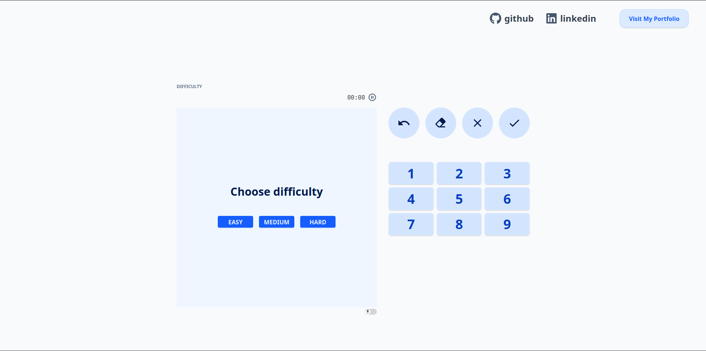
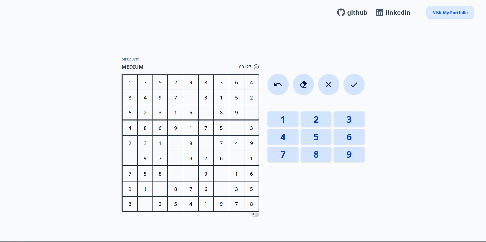

# React Sudoku

Offline sudoku made entirely in React. Includes a random sudoku generator alongside modern and intuitive features to ensure good gameplay experience.


# Demo




# Features

- Sudoku generator: Random sudoku generator
- Fast mode: Enable fast mode for least amount of action to solve the sudoku and set your best time
- Move history: Easily undo your mistakes
- Modern design: Clean and intuitive, focused on good user experience
- Respnosive: Enjoy sudoku on any device


# Installation with Docker

<!-- start:code block -->
## Clone this repository
```shell
git clone https://github.com/gruyovich/React-Sudoku.git
```

## Build the image
```shell
docker build -t react-sudoku ./React-Sudoku
```

## Run the container
```shell
docker run -p {your_port}:80 react-sudoku
```
<!-- end:code block -->


# Installation with npm

<!-- start:code block -->
## Clone this repository
```shell
git clone https://github.com/gruyovich/React-Sudoku.git
```

## Install dependencies
```shell
cd React-Sudoku
npm install
```

## Run the app
```shell
npm run dev
```
<!-- end:code block -->